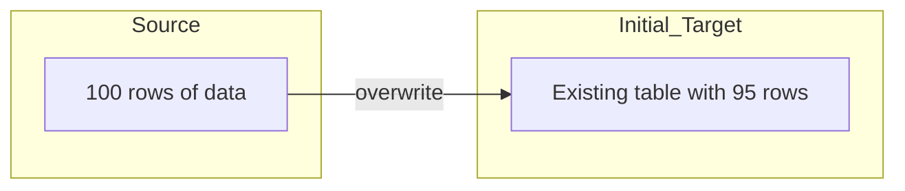

## 📘 Example 1 – Full Load with Overwrite

In this first lesson example, we’ll work with the simplest data ingestion approach: **full load with overwrite**. This strategy consists of completely rewriting the target table on each pipeline execution.

---

### 🔹 What happens in this strategy



📥 The target table content is **completely replaced** by the source data.

---

### 🧾 Table Before Load

| order_id | product_id | quantity | price |
|----------|-------------|----------|-------|
| 1        | 101         | 2        | 10.00 |
| 2        | 102         | 1        | 15.00 |
| ...      | ...         | ...      | ...   |

---

### 🧾 Table After Load

| order_id | product_id | quantity | price |
|----------|-------------|----------|-------|
| 1        | 101         | 3        | 10.00 |
| 2        | 102         | 2        | 15.00 |
| 3        | 103         | 1        | 20.00 |
| ...      | ...         | ...      | ...   |

📝 Notice that the data was **replaced**, even if not all records had changed.

---

### 🧠 When to use this approach

- Simple pipelines with small datasets
- Intermediate tables that don’t require history
- Scenarios where it's not possible to track changes (no reliable `id` or `timestamp`)

---

### ⚠️ Considerations

- Can cause loss of historical data
- May be costly for large volumes
- Requires sync between source and target

---

### 💻 PySpark Code for Full Load with Overwrite

Here’s an example of how to perform a full load using Spark with Delta Lake support:

```python
(df
  .write
  .mode("overwrite")
  .format("delta")
  .option("overwriteSchema", True)
  .saveAsTable("target_silver.example_table1"))
```

**Explanation of the options:**

- `.mode("overwrite")`: tells Spark to discard previous data.
- `.format("delta")`: we use Delta Lake format, which allows historical tracking, ACID transactions, and optimized performance.
- `.option("overwriteSchema", True)`: allows the table schema to be overwritten if it differs.
- `.saveAsTable(...)`: writes the data as a managed table in the Hive Metastore, making it available for SQL queries.

---

### 🔍 Viewing Delta History

After the operation, we can check the table’s history with:

```sql
DESCRIBE HISTORY target_silver.example_table1;
```

| version | timestamp           | operation | operationParameters                | numOutputRows | userName     |
|---------|---------------------|-----------|------------------------------------|----------------|--------------|
| 0       | 2024-01-01 10:00:00 | WRITE     | mode = Overwrite<br>format = delta | 100            | user@example |

📌 Delta logs that the operation was a `WRITE` with `mode = Overwrite`, confirming that data was replaced.

---

In the next step, we’ll evolve to a more efficient strategy: using `MERGE` to perform **inserts or updates** only when necessary.