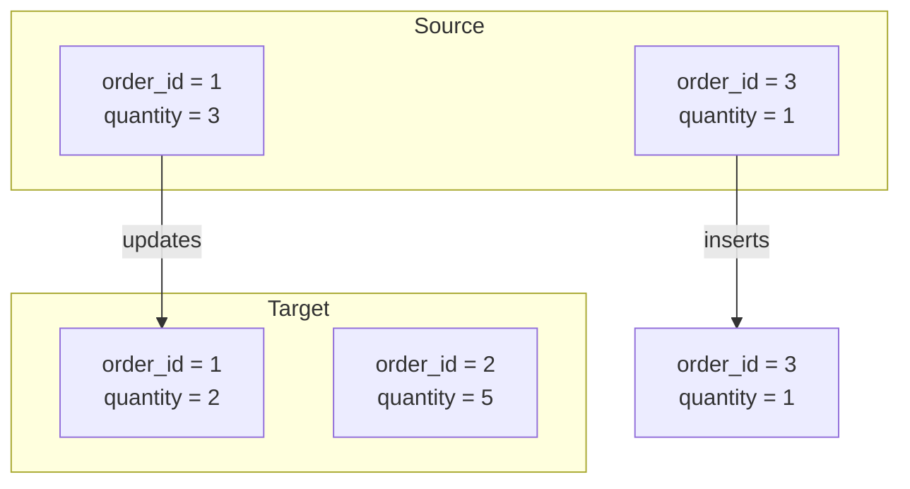

## 📘 Example 2 – Basic Merge (Insert/Update)

In this example, we'll use Delta Lake's `MERGE INTO` command to perform a simple incremental load. This strategy allows inserting new records and updating existing ones based on a primary key.

---

### 🔹 What happens in this strategy



🧩 The record with `order_id = 1` is updated. The record with `order_id = 3` is inserted.

---

### 🧾 Table Before Load

| order_id | product_id | quantity | price |
|----------|-------------|----------|-------|
| 1        | 101         | 2        | 10.00 |
| 2        | 102         | 5        | 15.00 |

---

### 🧾 Table After Load

| order_id | product_id | quantity | price |
|----------|-------------|----------|-------|
| 1        | 101         | 3        | 10.00 |
| 2        | 102         | 5        | 15.00 |
| 3        | 103         | 1        | 20.00 |

📥 Only changes are applied, without overwriting the entire table.

---

### 🧠 When to use this approach

- When there is a clear primary key
- Source provides full records by ID (no diffs)
- No need for historical tracking

---

### ⚠️ Considerations

- May cause unnecessary updates if data is identical
- May create conflicts if there are duplicates in the source
- Requires caution with composite or null keys

---

### 💻 PySpark Code – Basic Merge

```python
from delta.tables import DeltaTable

DeltaTable.forName(spark, "target_silver.example_table")\
  .alias("target")\
  .merge(
    df_new.alias("source"),
    "target.order_id = source.order_id"
  )\
  .whenMatchedUpdateAll()\
  .whenNotMatchedInsertAll()\
  .execute()
```

### 💻 Equivalent SQL Code

```sql
MERGE INTO target_silver.example_table AS target
USING new_data AS source
ON target.order_id = source.order_id
WHEN MATCHED THEN UPDATE SET *
WHEN NOT MATCHED THEN INSERT *;
```

**Command explanation:**

- `.whenMatchedUpdateAll()` / `UPDATE SET *`: updates all fields if a match is found by the key.
- `.whenNotMatchedInsertAll()` / `INSERT *`: inserts new records not found in the target.

---

### 🔍 Viewing Delta History

```sql
DESCRIBE HISTORY target_silver.example_table;
```

#### 📄 Simulated Delta History Result:

| version | timestamp           | operation | operationParameters                | operationMetrics                                            | numOutputRows | userName             |
|---------|---------------------|-----------|------------------------------------|-------------------------------------------------------------|----------------|----------------------|
| 0       | 2024-01-01 10:00:00 | WRITE     | mode = Overwrite<br>format = delta | {"numFiles": "4", "numOutputRows": "100"}                   | 100            | user@databricks.com  |
| 1       | 2024-01-02 08:00:00 | MERGE     | predicate = order_id               | {"numTargetRowsInserted": "1", "numTargetRowsUpdated": "1"} | 2              | user@databricks.com  |

📌 Delta logs operations in chronological order. The first version was a `WRITE` with `overwrite` (Example 1), followed by a `MERGE` with insert and update actions (Example 2).

---

In the next step, we’ll make ingestion smarter: by adding conditions based on the `modified_date` field.

