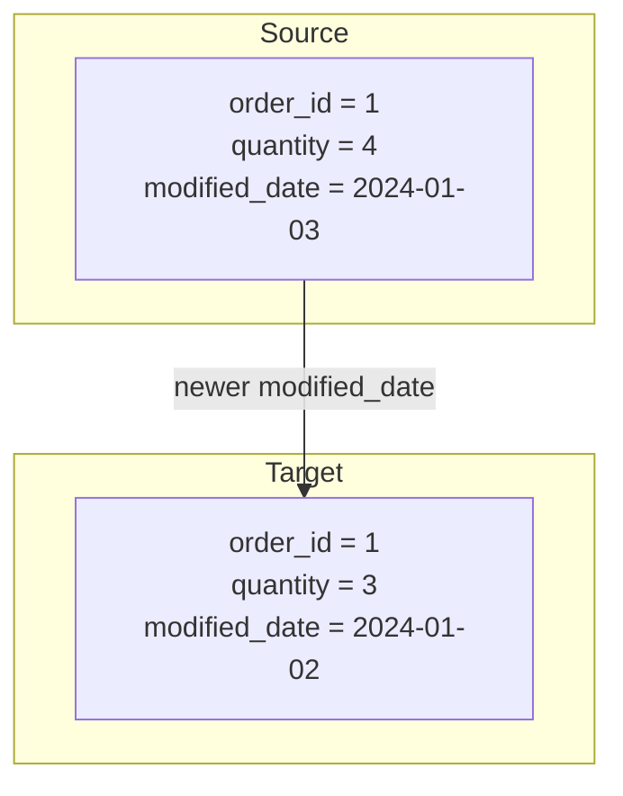

## 📘 Example 3 – Merge with `modified_date` Condition

In this example, we enhance the `MERGE` strategy by adding an extra condition: **we only update records if the `modified_date` from the source is more recent than the one in the target table**.

This approach avoids unnecessary updates and improves the efficiency of incremental ingestion.

---

### 🔹 What happens in this strategy



🧩 The record is updated **only if the `modified_date` is greater**.

---

### 🧾 Table Before Load

| order_id | product_id | quantity | price | modified_date |
|----------|-------------|----------|-------|----------------|
| 1        | 101         | 3        | 10.00 | 2024-01-02     |
| 2        | 102         | 5        | 15.00 | 2024-01-02     |

---

### 🧾 Table After Load

| order_id | product_id | quantity | price | modified_date |
|----------|-------------|----------|-------|----------------|
| 1        | 101         | 4        | 10.00 | 2024-01-03     |
| 2        | 102         | 5        | 15.00 | 2024-01-02     |

✅ Only the row with `order_id = 1` was updated.

---

### 🧠 When to use this approach

- Sources that maintain a `modified_date` or `last_updated` column
- Frequent pipelines where only real changes should be applied

---

### ⚠️ Considerations

- Requires high trust in the quality of the `modified_date` field
- Won’t detect changes if the date doesn’t change

---

### 💻 PySpark Code with `modified_date` Condition

```python
DeltaTable.forName(spark, "target_silver.example_table")\
  .alias("target")\
  .merge(
    df_new.alias("source"),
    "target.order_id = source.order_id"
  )\
  .whenMatchedUpdate(condition="source.modified_date > target.modified_date", set={"*": "source.*"})\
  .whenNotMatchedInsertAll()\
  .execute()
```

### 💻 Equivalent SQL Code

```sql
MERGE INTO target_silver.example_table AS target
USING new_data AS source
ON target.order_id = source.order_id
WHEN MATCHED AND source.modified_date > target.modified_date THEN
  UPDATE SET *
WHEN NOT MATCHED THEN INSERT *;
```

---

### 🔍 Viewing Delta History

```sql
DESCRIBE HISTORY target_silver.example_table;
```

| version | timestamp           | operation | operationParameters                | operationMetrics                                            | numOutputRows | userName             |
|---------|---------------------|-----------|------------------------------------|-------------------------------------------------------------|----------------|----------------------|
| 0       | 2024-01-01 10:00:00 | WRITE     | mode = Overwrite<br>format = delta | {"numFiles": "4", "numOutputRows": "100"}                   | 100            | user@databricks.com  |
| 1       | 2024-01-02 08:00:00 | MERGE     | predicate = order_id               | {"numTargetRowsInserted": "1", "numTargetRowsUpdated": "1"} | 2              | user@databricks.com  |
| 2       | 2024-01-03 07:00:00 | MERGE     | predicate = order_id               | {"numTargetRowsUpdated": "1"}                               | 1              | user@databricks.com  |

📌 Delta logs only the update to `order_id = 1`, as only it had a more recent `modified_date`.

---

In the next step, we’ll learn how to **deduplicate source records** to avoid `MERGE` conflicts, especially when multiple versions of the same ID arrive.

