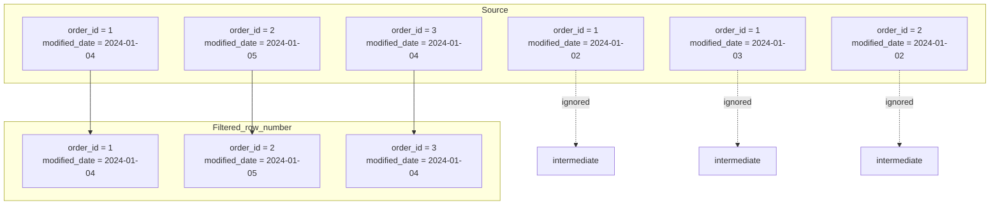

## 📘 Example 4 – Deduplication with `row_number()`

In this example, we’ll apply a strategy to **remove duplicates from the source before performing the `MERGE`**, using the window function `row_number()`.

This approach ensures that even if multiple versions of the same ID arrive from the source, only the most recent one (based on `modified_date`) will be used.

🧠 **Important:** this may mean that intermediate versions are ignored — i.e., we won’t have the full history of changes, only the latest final version. We’ll solve this in **Example 6**.

---

### 🔹 What happens in this strategy



📥 The `row_number()` function is used to keep **only the most recent record** per `order_id`, ignoring all previous — including intermediate — versions.

---

### 🧾 Sample Source with Duplicates

| order_id | product_id | quantity | price | modified_date |
|----------|-------------|----------|-------|----------------|
| 1        | 101         | 2        | 10.00 | 2024-01-02     |
| 1        | 101         | 3        | 10.00 | 2024-01-03     |
| 1        | 101         | 4        | 10.00 | 2024-01-04     |
| 2        | 102         | 4        | 15.00 | 2024-01-02     |
| 2        | 102         | 5        | 15.00 | 2024-01-05     |
| 3        | 103         | 2        | 20.00 | 2024-01-04     |

---

### 🧾 After Deduplication with `row_number = 1`

| order_id | product_id | quantity | price | modified_date |
|----------|-------------|----------|-------|----------------|
| 1        | 101         | 4        | 10.00 | 2024-01-04     |
| 2        | 102         | 5        | 15.00 | 2024-01-05     |
| 3        | 103         | 2        | 20.00 | 2024-01-04     |

🔎 Notice that we ignored the versions of `order_id = 1` from 2024-01-02 and 2024-01-03, and `order_id = 2` from 2024-01-02. Only the latest version remains.

📌 **This behavior is efficient but loses intermediate history**. In the next example, we’ll address how to record all versions correctly with full historical control (SCD2).

---

### 💻 PySpark Code with Deduplication + Merge

```python
from pyspark.sql.window import Window
from pyspark.sql.functions import col, row_number
from delta.tables import DeltaTable

window = Window.partitionBy("order_id").orderBy(col("modified_date").desc())

df_deduplicated = (
  df_new
  .withColumn("row_number", row_number().over(window))
  .filter("row_number = 1")
  .drop("row_number")
)

DeltaTable.forName(spark, "target_silver.example_table")\
  .alias("target")\
  .merge(
    df_deduplicated.alias("source"),
    "target.order_id = source.order_id"
  )\
  .whenMatchedUpdate(condition = "source.modified_date > target.modified_date", set = {"*": "source.*"})\
  .whenNotMatchedInsertAll()\
  .execute()
```

### 💻 SQL Version with Deduplication and Merge

```sql
-- Creates a CTE to keep only the most recent record per order_id
WITH deduplicated_source AS (
  SELECT * FROM (
    SELECT *,
           ROW_NUMBER() OVER (PARTITION BY order_id ORDER BY modified_date DESC) AS rn
    FROM new_data
  ) tmp
  WHERE rn = 1
)

MERGE INTO target_silver.example_table AS target
USING deduplicated_source AS source
ON target.order_id = source.order_id
WHEN MATCHED AND source.modified_date > target.modified_date THEN
  UPDATE SET *
WHEN NOT MATCHED THEN INSERT *;
```

---

### 🔍 Viewing Delta History

```sql
DESCRIBE HISTORY target_silver.example_table;
```

| version | timestamp           | operation | operationParameters                | operationMetrics                                            | numOutputRows | userName             |
|---------|---------------------|-----------|------------------------------------|-------------------------------------------------------------|----------------|----------------------|
| 0       | 2024-01-01 10:00:00 | WRITE     | mode = Overwrite<br>format = delta | {"numFiles": "4", "numOutputRows": "100"}                   | 100            | user@databricks.com  |
| 1       | 2024-01-02 08:00:00 | MERGE     | predicate = order_id               | {"numTargetRowsInserted": "1", "numTargetRowsUpdated": "1"} | 2              | user@databricks.com  |
| 2       | 2024-01-03 07:00:00 | MERGE     | predicate = order_id               | {"numTargetRowsUpdated": "1"}                               | 1              | user@databricks.com  |
| 3       | 2024-01-04 09:00:00 | MERGE     | predicate = order_id               | {"numTargetRowsInserted": "1", "numTargetRowsUpdated": "2"} | 3              | user@databricks.com  |

📌 Delta logs the operation as `MERGE`, with 3 affected rows: two updates and one insert, thanks to prior deduplication.

---

In the next step, we’ll learn how to implement complete historical tracking using SCD Type 2, including `hash`, `modified_date`, control flags, and multiple versions of the same record.

