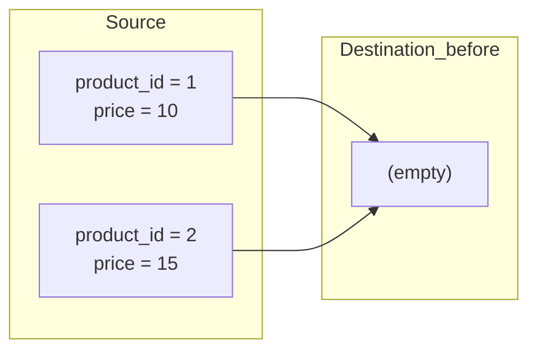
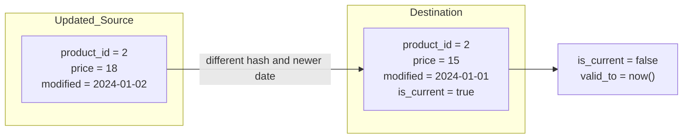
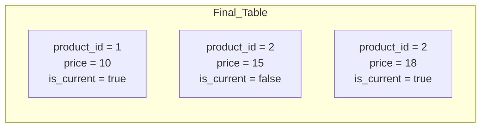

## 📘 Example 5 – SCD Type 2 with Hash, `modified_date` and Three Steps

In this example, we will implement a **Slowly Changing Dimension Type 2 (SCD Type 2)**. This pattern is used when we need to preserve all previous versions of a record — maintaining a history of changes.

### 🧠 What is SCD Type 2?

SCD Type 2 creates **a new record** each time a change is detected, keeping the previous version using control fields like `valid_to`, `is_current`, etc. This is essential for:

- Auditing changes
- Generating reports that respect the value in effect at a given time
- Rebuilding historical dimension states

### 🔍 How do we detect changes?

We use a `hash` calculated over business columns (excluding technical ones) to detect whether something changed. We also use `modified_date` to ensure only newer data is used for updates.

---

### 🧮 How is the Hash calculated (in PySpark)?

```python
from pyspark.sql.functions import xxhash64, current_date, lit, coalesce, col, concat_ws, date_add, current_timestamp

# Load data
df_source = spark.table("source_bronze.sales_salesorderdetail_insert_duplicates")

# Simulate future modifications (just for demonstration)
df_source = df_source.withColumn("ModifiedDate", date_add(df_source["ModifiedDate"], 50))

# Build hash based on all columns
stringified_columns = [coalesce(col(c).cast("string"), lit("NULL")) for c in df_source.columns]
df_source = df_source.withColumn("hash_value", xxhash64(concat_ws("||", *stringified_columns)))

# Add SCD2 control columns
df_source = df_source.withColumn("is_current", lit(True)) \
                     .withColumn("start_date", current_timestamp()) \
                     .withColumn("end_date", lit(None).cast("date"))

# Create temporary view for SQL use
df_source.dropDuplicates(["SalesOrderDetailID"]).createOrReplaceTempView("df_source")
```

---

### 🔁 SCD2 Strategy in 3 Steps:

#### 🔹 Step 1 – Insert New Records



#### 🔹 Step 2 – Finalize Records with Different Hash and Newer `modified_date`



#### 🔹 Step 3 – Insert New Version (only if `modified_date` is greater)



---

### 🧾 Example Data – Before and After

#### 🔍 Source (incoming data)

| product_id | price | modified_date     | Note                                       |
|------------|-------|-------------------|--------------------------------------------|
| 1          | 10    | 2024-01-01        | New                                        |
| 2          | 15    | 2024-01-01        | New                                        |
| 2          | 18    | 2024-01-02        | Valid update                               |
| 2          | 18    | 2024-01-01        | ⛔️ Ignored – same version with old date     |
| 2          | 15    | 2023-12-30        | ⛔️ Ignored – older version, no impact       |

#### ✅ Final Table (with history)

| product_id | price | modified_date     | valid_from       | valid_to         | is_current | hash_value |
|------------|-------|-------------------|------------------|------------------|------------|------------|
| 1          | 10    | 2024-01-01        | 2024-01-01       | *(null)*         | ✅ true     | A1X...     |
| 2          | 15    | 2024-01-01        | 2024-01-01       | 2024-01-02       | ❌ false    | B7F...     |
| 2          | 18    | 2024-01-02        | 2024-01-02       | *(null)*         | ✅ true     | 9ZK...     |

---

### 💻 SQL Code Split in 3 Steps

#### ☑️ Step 1 – Initial Insert

```sql
MERGE INTO hive_metastore.target_silver.ex5_sales_salesorderdetail AS target
USING df_source AS source
ON target.SalesOrderID = source.SalesOrderID AND target.SalesOrderDetailID = source.SalesOrderDetailID
WHEN NOT MATCHED THEN
  INSERT *
```

#### 🛑 Step 2 – Finalize Old Versions

```sql
MERGE INTO hive_metastore.target_silver.ex5_sales_salesorderdetail AS target
USING df_source AS source
ON target.SalesOrderID = source.SalesOrderID AND target.SalesOrderDetailID = source.SalesOrderDetailID
WHEN MATCHED AND target.hash_value != source.hash_value AND target.is_current = TRUE AND source.ModifiedDate > target.ModifiedDate THEN
  UPDATE SET target.is_current = FALSE,
             target.end_date = CURRENT_DATE
```

#### 🔁 Step 3 – Insert New Version (using filtered CTE)

```sql
WITH filtered_source AS (
  SELECT source.*
  FROM df_source AS source
  LEFT JOIN hive_metastore.target_silver.ex5_sales_salesorderdetail AS target
  ON target.SalesOrderID = source.SalesOrderID AND target.SalesOrderDetailID = source.SalesOrderDetailID
  WHERE source.ModifiedDate > target.ModifiedDate
)
MERGE INTO hive_metastore.target_silver.ex5_sales_salesorderdetail AS target
USING filtered_source AS source
ON target.SalesOrderID = source.SalesOrderID AND target.SalesOrderDetailID = source.SalesOrderDetailID AND target.hash_value = source.hash_value 
WHEN NOT MATCHED THEN
  INSERT *
```

---

### 💻 Equivalent PySpark Code (alternate version)

```python
from delta.tables import DeltaTable

# Step 1 – Finalize old versions by marking is_current = false
DeltaTable.forName(spark, "target_silver.ex5_sales_salesorderdetail")\
  .alias("target")\
  .merge(
    df_source.alias("source"),
    "target.SalesOrderID = source.SalesOrderID AND "
    "target.SalesOrderDetailID = source.SalesOrderDetailID AND "
    "target.is_current = true AND source.hash_value != target.hash_value AND "
    "source.ModifiedDate > target.ModifiedDate"
  )\
  .whenMatchedUpdate(set={
    "is_current": "false",
    "end_date": "current_date()"
  })\
  .execute()

# Step 2 – Insert new versions filtered by modified_date > target
more_recent = df_source.alias("source").join(
  spark.table("target_silver.ex5_sales_salesorderdetail").alias("target"),
  on=["SalesOrderID", "SalesOrderDetailID"],
  how="left"
).filter("source.ModifiedDate > target.ModifiedDate OR target.SalesOrderID IS NULL")

DeltaTable.forName(spark, "target_silver.ex5_sales_salesorderdetail")\
  .alias("target")\
  .merge(
    more_recent.alias("source"),
    "target.SalesOrderID = source.SalesOrderID AND "
    "target.SalesOrderDetailID = source.SalesOrderDetailID AND "
    "target.hash_value = source.hash_value"
  )\
  .whenNotMatchedInsertAll()\
  .execute()
```

---

### ✅ Conclusion

This example clearly demonstrated how to implement the **SCD Type 2 pattern with hash and `modified_date`** in a Lakehouse environment using Delta Lake. We broke the process into logical steps:

1. Inserting new records
2. Finalizing changed records
3. Inserting new versions based on the latest modification date

We included complete code in SQL and PySpark, before-and-after tables, and diagrams to aid understanding.

In the next step, we’ll move to **Example 6**, where we’ll address **historical reloading**, using a `for loop` to ensure all intermediate changes are processed and no version is skipped.

Let’s go!

