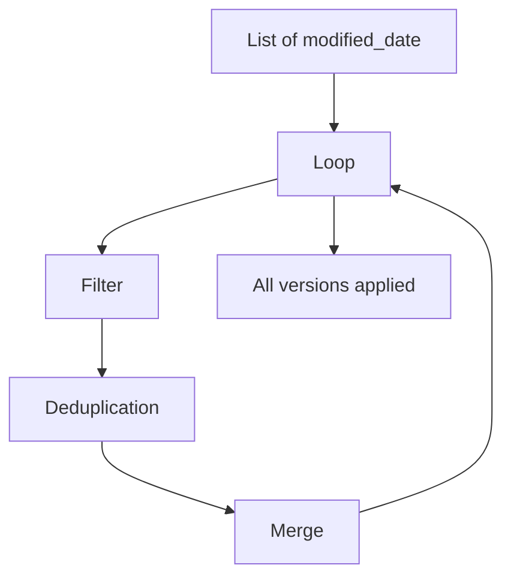

## 📘 Example 6 – Historical Reload with Iteration over `modified_date`

In this example, we handle **multiple versions of the same record** that arrive on different dates. The goal is to ensure that **all changes are applied in chronological order**, preserving full history using the **SCD Type 2** pattern.

---

### 🧠 Scenario

In production pipelines, we often deal with only the latest version of a record. However, in situations like:

- 🔁 Full reload
- 🧼 Historical maintenance
- 🔄 Retrospective reprocessing

...it's crucial to ensure that **intermediate versions** are correctly applied.

---

### 🎯 Strategy Used

1. Get distinct values of `modified_date` from the source.
2. Iterate over each date, **in chronological order**.
3. For each `modified_date`:
   - Filter data for that day.
   - Remove duplicates using `row_number()` to keep the most recent record per ID.
   - Apply SCD2 using `MERGE`.

This approach allows us to apply changes **in the order they occurred**, ensuring historical integrity.

---

### 🔁 Loop Strategy Diagram



---

### 🔢 Example Data with Multiple Versions

#### 🔍 Source (incoming data)

| product_id | price | modified_date     | Note                              |
|------------|-------|-------------------|-----------------------------------|
| 1          | 10    | 2024-01-01        | New                               |
| 2          | 15    | 2024-01-01        | Version 1                         |
| 2          | 15    | 2024-01-01        | ⛔️ Duplicate (ignored)            |
| 2          | 16    | 2024-01-02        | Version 2                         |
| 2          | 18    | 2024-01-03        | Version 3 (final)                 |

#### ✅ Final Table (with full history)

| product_id | price | modified_date     | valid_from       | valid_to         | is_current |
|------------|-------|-------------------|------------------|------------------|------------|
| 1          | 10    | 2024-01-01        | 2024-01-01       | *(null)*         | ✅ true     |
| 2          | 15    | 2024-01-01        | 2024-01-01       | 2024-01-02       | ❌ false    |
| 2          | 16    | 2024-01-02        | 2024-01-02       | 2024-01-03       | ❌ false    |
| 2          | 18    | 2024-01-03        | 2024-01-03       | *(null)*         | ✅ true     |

---

### 🧪 PySpark Code – Iteration over `modified_date` with deduplication

```python
from delta.tables import DeltaTable
from pyspark.sql.window import Window
from pyspark.sql.functions import row_number, col

# Get list of ordered distinct dates
dates = [row.modified_date for row in df_source.select("modified_date").distinct().orderBy("modified_date").collect()]

target_table = DeltaTable.forName(spark, "target_silver.ex6_sales_orderdetail")

for date in dates:
    print(f"\n🔁 Processing data from: {date}")

    daily_df = df_source.filter(col("modified_date") == date)

    # Deduplication using row_number over natural keys
    window_spec = Window.partitionBy("SalesOrderID", "SalesOrderDetailID").orderBy(col("modified_date").desc())
    daily_df = daily_df.withColumn("row_num", row_number().over(window_spec)).filter("row_num = 1").drop("row_num")
    daily_df.createOrReplaceTempView("source_day")

    # Step 1 – Finalize old records
    spark.sql("""
    MERGE INTO target_silver.ex6_sales_orderdetail AS target
    USING source_day AS source
    ON target.SalesOrderID = source.SalesOrderID AND target.SalesOrderDetailID = source.SalesOrderDetailID
    WHEN MATCHED AND target.hash_value != source.hash_value AND target.is_current = TRUE AND source.modified_date > target.modified_date THEN
      UPDATE SET target.is_current = FALSE,
                 target.end_date = CURRENT_DATE
    """)

    # Step 2 – Insert new version
    spark.sql("""
    WITH filtered_source AS (
        SELECT source.*
        FROM source_day AS source
        LEFT JOIN target_silver.ex6_sales_orderdetail AS target
        ON target.SalesOrderID = source.SalesOrderID AND target.SalesOrderDetailID = source.SalesOrderDetailID
        WHERE source.modified_date > target.modified_date OR target.SalesOrderID IS NULL
    )
    MERGE INTO target_silver.ex6_sales_orderdetail AS target
    USING filtered_source AS source
    ON target.SalesOrderID = source.SalesOrderID AND target.SalesOrderDetailID = source.SalesOrderDetailID AND target.hash_value = source.hash_value
    WHEN NOT MATCHED THEN
      INSERT *
    """)
```

---

### ✅ Conclusion

In this example, we demonstrated how to perform a **complete and chronological historical reload for SCD2**, using the `modified_date` field as the guide.

We also ensured that, for each date, only the **latest record per ID** is used — avoiding duplicates and `MERGE` conflicts.

This approach is ideal for:

- 🧹 Maintenance pipelines
- 🔁 Historical reprocessing
- 📦 Applying multiple intermediate versions

In practice, this ensures that each version of a record is properly inserted and closed, maintaining the data's integrity and traceability.

Ready to move on to the next challenge? 🚀

