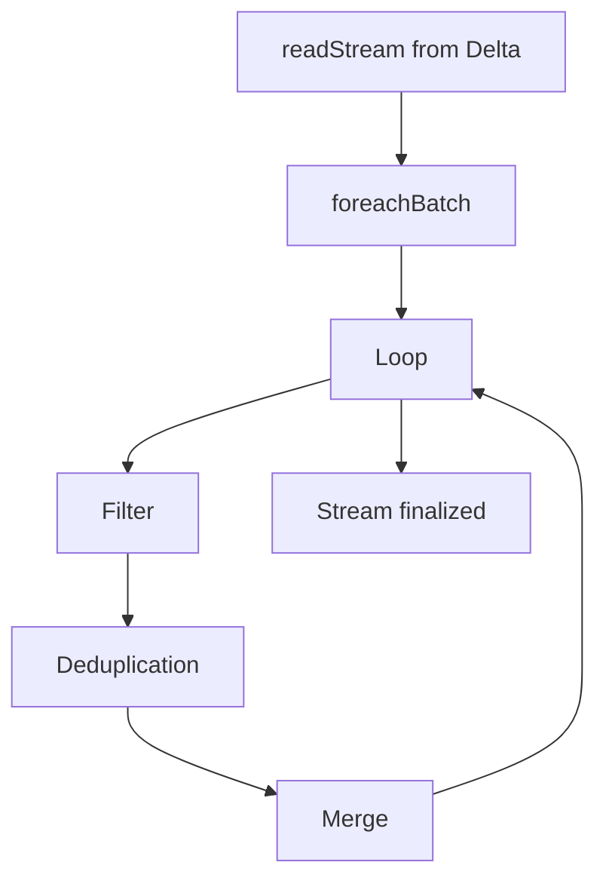

## 📘 Example 7 – Historical Reload via Streaming with Iteration by `modified_date`

In this example, we expand the idea of historical reloading (Example 6), now assuming that the **source is a Delta Table read in Streaming mode**. We use Spark Structured Streaming’s `foreachBatch` feature to apply the **SCD Type 2** logic per batch.

---

### 🧠 Scenario

This scenario is ideal for:

- Pipelines that require historical control from a streaming source
- Continuous ingestion cases that require temporal consistency
- Automated full reloads with cluster auto shutdown

---

### 🎯 Strategy Used

1. Read the Delta table as a stream (`readStream`)
2. For each received batch, apply:
   - Get distinct values of `modified_date`
   - Iterate by date (in chronological order)
   - Deduplicate using `row_number()` by natural key
   - Apply SCD Type 2 via `MERGE`
3. Finalize the stream with `trigger=availableNow` to shut down the cluster at the end
4. Use `checkpoint` to ensure fault tolerance

---

### 🔁 Strategy Diagram with Streaming



---

### 💻 PySpark Code with Streaming, `foreachBatch`, and `MERGE`

```python
from delta.tables import DeltaTable
from pyspark.sql.window import Window
from pyspark.sql.functions import row_number, col

# Read as streaming
streaming_df = (
  spark.readStream
       .format("delta")
       .table("source_bronze.sales_salesorderdetail_insert_duplicates")
)

def process_batch(df_batch, batch_id):
    print(f"🔁 Processing batch: {batch_id}")

    dates = [row.modified_date for row in df_batch.select("modified_date").distinct().orderBy("modified_date").collect()]

    for date in dates:
        daily_df = df_batch.filter(col("modified_date") == date)

        window_spec = Window.partitionBy("SalesOrderID", "SalesOrderDetailID").orderBy(col("modified_date").desc())
        daily_df = daily_df.withColumn("row_num", row_number().over(window_spec)).filter("row_num = 1").drop("row_num")
        daily_df.createOrReplaceTempView("source_day")

        # Step 1 – Finalize old records
        spark.sql("""
        MERGE INTO target_silver.ex6_sales_orderdetail AS target
        USING source_day AS source
        ON target.SalesOrderID = source.SalesOrderID AND target.SalesOrderDetailID = source.SalesOrderDetailID
        WHEN MATCHED AND target.hash_value != source.hash_value AND target.is_current = TRUE AND source.modified_date > target.modified_date THEN
          UPDATE SET target.is_current = FALSE,
                     target.end_date = CURRENT_DATE
        """)

        # Step 2 – Insert new version
        spark.sql("""
        WITH filtered_source AS (
            SELECT source.*
            FROM source_day AS source
            LEFT JOIN target_silver.ex6_sales_orderdetail AS target
            ON target.SalesOrderID = source.SalesOrderID AND target.SalesOrderDetailID = source.SalesOrderDetailID
            WHERE source.modified_date > target.modified_date OR target.SalesOrderID IS NULL
        )
        MERGE INTO target_silver.ex6_sales_orderdetail AS target
        USING filtered_source AS source
        ON target.SalesOrderID = source.SalesOrderID AND target.SalesOrderDetailID = source.SalesOrderDetailID AND target.hash_value = source.hash_value
        WHEN NOT MATCHED THEN
          INSERT *
        """)

# Execute the stream
(
  streaming_df.writeStream
    .foreachBatch(process_batch)
    .trigger(availableNow=True)
    .option("checkpointLocation", "/mnt/checkpoints/ex6_history")
    .start()
)
```

---

### 📌 Important Details about Spark Structured Streaming

- ✅ **`foreachBatch`**: allows custom logic per batch using the Spark batch APIs.
- ✅ **`trigger(availableNow=True)`**: ensures the stream runs once with the available data and stops automatically.
- ✅ **Checkpointing**: mandatory in streams; it saves execution state and enables recovery after failures.

This strategy combines the **flexibility of batch processing** with **streaming orchestration**, enabling controlled, efficient, and safe historical reloads.

---

### ✅ Conclusion

This example shows how to use Spark Structured Streaming with `foreachBatch` to perform an ordered, efficient historical reload with full control using the SCD Type 2 pattern.

We also used advanced features such as `trigger(availableNow)` and checkpointing to ensure automation and fault tolerance.

Ready to apply this pattern in production environments? 🚀

