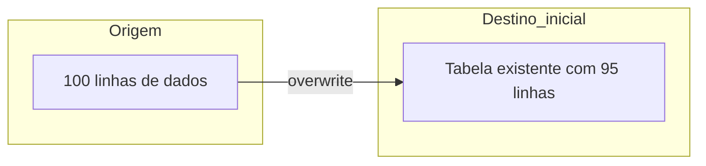

## 📘 Exemplo 1 – Full Load com Overwrite

Neste primeiro exemplo da aula, vamos trabalhar com a abordagem mais simples de ingestão de dados: **carga completa com sobrescrita**. Esta estratégia consiste em reescrever completamente a tabela de destino a cada execução da pipeline.

---

### 🔹 O que acontece nessa estratégia



📥 O conteúdo da tabela de destino é **substituído por completo** com os dados da origem.

---

### 🧾 Tabela Antes da Carga


| order_id | product_id | quantity | price |
| ---------- | ------------ | ---------- | ------- |
| 1        | 101        | 2        | 10.00 |
| 2        | 102        | 1        | 15.00 |
| ...      | ...        | ...      | ...   |

---

### 🧾 Tabela Depois da Carga


| order_id | product_id | quantity | price |
| ---------- | ------------ | ---------- | ------- |
| 1        | 101        | 3        | 10.00 |
| 2        | 102        | 2        | 15.00 |
| 3        | 103        | 1        | 20.00 |
| ...      | ...        | ...      | ...   |

📝 Perceba que os dados foram **substituídos**, mesmo que não tenha havido alteração em todos os registros.

---

### 🧠 Quando usar essa abordagem

- Pipelines simples, com dados pequenos
- Tabelas intermediárias que não precisam de histórico
- Situações onde não é possível identificar mudanças (sem `id` ou `timestamp` confiável)

---

### ⚠️ Cuidados

- Pode causar perda de histórico
- Pode ser custoso em grandes volumes
- Exige sincronismo entre origem e destino

---

### 💻 Código PySpark para Full Load com Overwrite

Abaixo temos um exemplo de como realizar a carga completa utilizando o Spark com suporte a Delta Lake:

```python
(df
  .write
  .mode("overwrite")
  .format("delta")
  .option("overwriteSchema", True)
  .saveAsTable("target_silver.tabela_exemplo1"))
```

**Explicação das opções:**

- `.mode("overwrite")`: indica que os dados anteriores devem ser descartados.
- `.format("delta")`: usamos o formato Delta Lake, que permite rastreamento de histórico, transações ACID e performance otimizada.
- `.option("overwriteSchema", True)`: permite sobrescrever o esquema da tabela, se houver diferenças.
- `.saveAsTable(...)`: grava os dados como uma tabela gerenciada no Hive Metastore, permitindo consultas com SQL.

---

### 🔍 Visualizando o Delta History

Após a operação, podemos consultar o histórico da tabela com:

```sql
DESCRIBE HISTORY target_silver.tabela_exemplo1;
```


| version | timestamp           | operation | operationParameters                | numOutputRows | userName  |
| --------- | --------------------- | ----------- | ------------------------------------ | --------------- | ----------- |
| 0       | 2024-01-01 10:00:00 | WRITE     | mode = Overwrite<br>format = delta | 100           | usuario@x |

📌 O Delta registra que a operação foi um `WRITE` com `mode = Overwrite`, confirmando que os dados foram substituídos.

---

Na próxima etapa, vamos evoluir para uma estratégia mais eficiente: o uso de `MERGE` para fazer **insert ou update** somente quando necessário.
