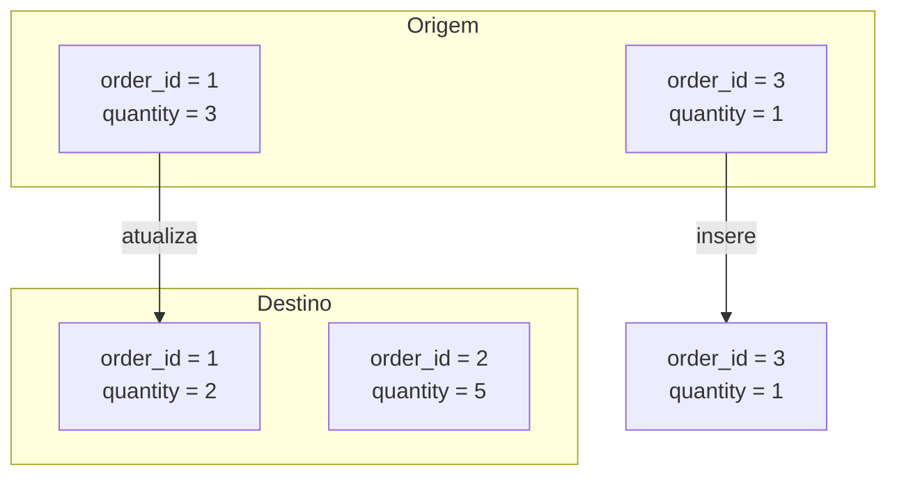

## 📘 Exemplo 2 – Merge Básico (Insert/Update)

Neste exemplo, vamos usar o comando `MERGE INTO` do Delta Lake para realizar uma ingestão incremental simples. Essa estratégia permite inserir registros novos e atualizar registros existentes, com base em uma chave primária.

---

### 🔹 O que acontece nessa estratégia



🧩 O registro `order_id = 1` é atualizado. O registro `order_id = 3` é inserido.

---

### 🧾 Tabela Antes da Carga


| order_id | product_id | quantity | price |
| ---------- | ------------ | ---------- | ------- |
| 1        | 101        | 2        | 10.00 |
| 2        | 102        | 5        | 15.00 |

---

### 🧾 Tabela Depois da Carga


| order_id | product_id | quantity | price |
| ---------- | ------------ | ---------- | ------- |
| 1        | 101        | 3        | 10.00 |
| 2        | 102        | 5        | 15.00 |
| 3        | 103        | 1        | 20.00 |

📥 Somente as mudanças são aplicadas, sem sobrescrever a tabela inteira.

---

### 🧠 Quando usar essa abordagem

- Quando há uma chave primária clara
- Fontes que enviam dados completos (sem diff) por ID
- Casos em que não há necessidade de controle histórico

---

### ⚠️ Cuidados

- Pode gerar atualizações desnecessárias se os dados forem idênticos
- Pode causar conflitos se houver duplicatas na origem
- Requer cuidado com chaves compostas ou nulas

---

### 💻 Código PySpark com Merge Básico

```python
from delta.tables import DeltaTable

DeltaTable.forName(spark, "target_silver.tabela_exemplo")\
  .alias("target")\
  .merge(
    df_novos.alias("source"),
    "target.order_id = source.order_id"
  )\
  .whenMatchedUpdateAll()\
  .whenNotMatchedInsertAll()\
  .execute()
```

### 💻 Código SQL equivalente

```sql
MERGE INTO target_silver.tabela_exemplo AS target
USING novos_dados AS source
ON target.order_id = source.order_id
WHEN MATCHED THEN UPDATE SET *
WHEN NOT MATCHED THEN INSERT *;
```

**Explicação dos comandos:**

- `.whenMatchedUpdateAll()` / `UPDATE SET *`: atualiza todos os campos se encontrar correspondência pela chave.
- `.whenNotMatchedInsertAll()` / `INSERT *`: insere registros novos que ainda não existem no destino.

---

### 🔍 Visualizando o Delta History

```sql
DESCRIBE HISTORY target_silver.tabela_exemplo;
```

#### 📄 Resultado Simulado do Histórico Delta:


| version | timestamp           | operation | operationParameters                | operationMetrics                                            | numOutputRows | userName               |
| --------- | --------------------- | ----------- | ------------------------------------ | ------------------------------------------------------------- | --------------- | ------------------------ |
| 0       | 2024-01-01 10:00:00 | WRITE     | mode = Overwrite<br>format = delta | {"numFiles": "4", "numOutputRows": "100"}                   | 100           | usuario@databricks.com |
| 1       | 2024-01-02 08:00:00 | MERGE     | predicate = order_id               | {"numTargetRowsInserted": "1", "numTargetRowsUpdated": "1"} | 2             | usuario@databricks.com |

📌 O Delta registra as operações em ordem cronológica. A primeira versão foi um `WRITE` com `overwrite` (Exemplo 1), seguida por um `MERGE` com inserção e atualização (Exemplo 2).

---

Na próxima etapa, vamos tornar a ingestão mais inteligente: adicionando condições com base no campo `modified_date`.
