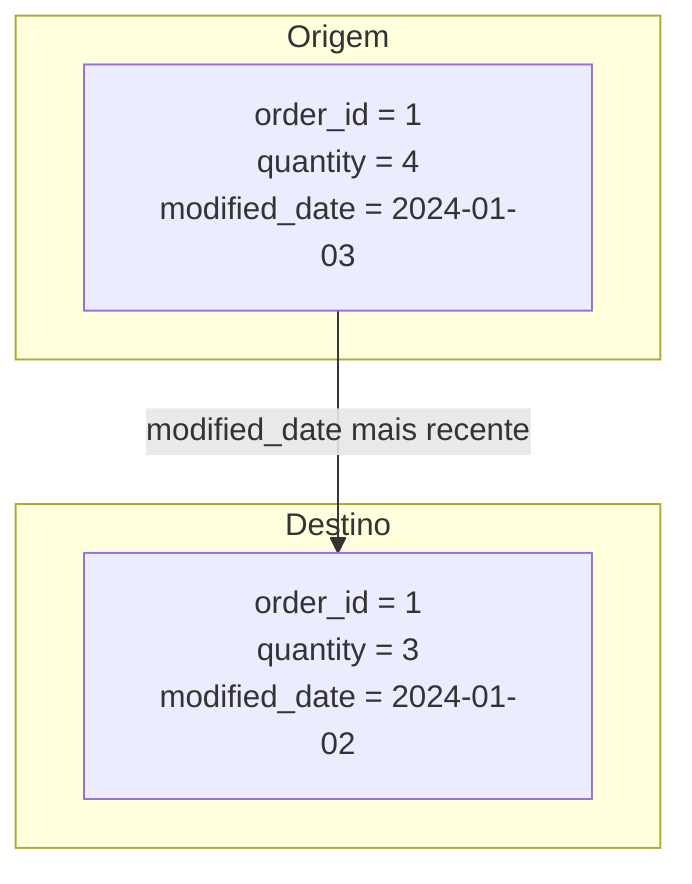

## 📘 Exemplo 3 – Merge com Condição de `modified_date`

Neste exemplo, vamos evoluir a estratégia de `MERGE` incluindo uma condição adicional: **só atualizamos registros se a data de modificação na origem (`modified_date`) for mais recente que a da tabela de destino**.

Essa abordagem evita updates desnecessários e melhora a eficiência da ingestão incremental.

---

### 🔹 O que acontece nessa estratégia



🧩 O registro será atualizado **apenas se o campo `modified_date` for maior**.

---

### 🧾 Tabela Antes da Carga


| order_id | product_id | quantity | price | modified_date |
| ---------- | ------------ | ---------- | ------- | --------------- |
| 1        | 101        | 3        | 10.00 | 2024-01-02    |
| 2        | 102        | 5        | 15.00 | 2024-01-02    |

---

### 🧾 Tabela Depois da Carga


| order_id | product_id | quantity | price | modified_date |
| ---------- | ------------ | ---------- | ------- | --------------- |
| 1        | 101        | 4        | 10.00 | 2024-01-03    |
| 2        | 102        | 5        | 15.00 | 2024-01-02    |

✅ Apenas a linha com `order_id = 1` foi atualizada.

---

### 🧠 Quando usar essa abordagem

- Fontes que mantêm uma coluna `modified_date` ou `last_updated`
- Pipelines frequentes onde só as mudanças reais devem ser aplicadas

---

### ⚠️ Cuidados

- Exige confiança na qualidade do campo `modified_date`
- Não detecta mudanças se a data não mudar

---

### 💻 Código PySpark com Condição de `modified_date`

```python
DeltaTable.forName(spark, "target_silver.tabela_exemplo")\
  .alias("target")\
  .merge(
    df_novos.alias("source"),
    "target.order_id = source.order_id"
  )\
  .whenMatchedUpdate(condition = "source.modified_date > target.modified_date", set = {"*": "source.*"})\
  .whenNotMatchedInsertAll()\
  .execute()
```

### 💻 Código SQL equivalente

```sql
MERGE INTO target_silver.tabela_exemplo AS target
USING novos_dados AS source
ON target.order_id = source.order_id
WHEN MATCHED AND source.modified_date > target.modified_date THEN
  UPDATE SET *
WHEN NOT MATCHED THEN INSERT *;
```

---

### 🔍 Visualizando o Delta History

```sql
DESCRIBE HISTORY target_silver.tabela_exemplo;
```


| version | timestamp           | operation | operationParameters                | operationMetrics                                            | numOutputRows | userName               |
| --------- | --------------------- | ----------- | ------------------------------------ | ------------------------------------------------------------- | --------------- | ------------------------ |
| 0       | 2024-01-01 10:00:00 | WRITE     | mode = Overwrite<br>format = delta | {"numFiles": "4", "numOutputRows": "100"}                   | 100           | usuario@databricks.com |
| 1       | 2024-01-02 08:00:00 | MERGE     | predicate = order_id               | {"numTargetRowsInserted": "1", "numTargetRowsUpdated": "1"} | 2             | usuario@databricks.com |
| 2       | 2024-01-03 07:00:00 | MERGE     | predicate = order_id               | {"numTargetRowsUpdated": "1"}                               | 1             | usuario@databricks.com |

📌 O Delta registra apenas o update em `order_id = 1`, pois só ele tinha `modified_date` maior.

---

Na próxima etapa, vamos aprender a **deduplicar registros da origem** para evitar conflitos de `MERGE`, especialmente quando chegam várias versões de um mesmo ID.
