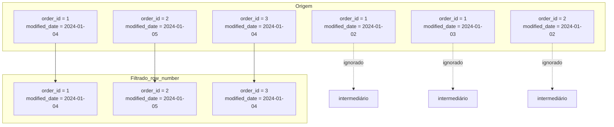

## 📘 Exemplo 4 – Deduplicação com `row_number()`

Neste exemplo, vamos aplicar uma estratégia para **remover duplicatas da origem antes de realizar o `MERGE`**, utilizando a função de janela `row_number()`.

Essa abordagem garante que, mesmo se chegarem múltiplas versões de um mesmo ID na origem, apenas a mais recente (baseada em `modified_date`) será usada.

🧠 **Importante:** isso pode significar que versões intermediárias serão ignoradas — ou seja, não teremos o histórico completo de mudanças, apenas a versão final mais recente. Vamos resolver isso no **Exemplo 6**.

---

### 🔹 O que acontece nessa estratégia



📥 A função `row_number()` é usada para manter **apenas o registro mais recente** de cada `order_id`, ignorando todas as versões anteriores — inclusive intermediárias.

---

### 🧾 Exemplo de Origem com Duplicatas


| order_id | product_id | quantity | price | modified_date |
| ---------- | ------------ | ---------- | ------- | --------------- |
| 1        | 101        | 2        | 10.00 | 2024-01-02    |
| 1        | 101        | 3        | 10.00 | 2024-01-03    |
| 1        | 101        | 4        | 10.00 | 2024-01-04    |
| 2        | 102        | 4        | 15.00 | 2024-01-02    |
| 2        | 102        | 5        | 15.00 | 2024-01-05    |
| 3        | 103        | 2        | 20.00 | 2024-01-04    |

---

### 🧾 Após deduplicação com `row_number = 1`


| order_id | product_id | quantity | price | modified_date |
| ---------- | ------------ | ---------- | ------- | --------------- |
| 1        | 101        | 4        | 10.00 | 2024-01-04    |
| 2        | 102        | 5        | 15.00 | 2024-01-05    |
| 3        | 103        | 2        | 20.00 | 2024-01-04    |

🔎 Perceba que ignoramos as versões de `order_id = 1` em 2024-01-02 e 2024-01-03, e de `order_id = 2` em 2024-01-02. Apenas a última versão está presente.

📌 **Esse comportamento é eficiente, mas perde o histórico intermediário**. No próximo exemplo, vamos abordar como registrar todas as versões corretamente com controle de histórico (SCD2).

---

### 💻 Código PySpark com Deduplicação + Merge

```python
from pyspark.sql.window import Window
from pyspark.sql.functions import col, row_number
from delta.tables import DeltaTable

janela = Window.partitionBy("order_id").orderBy(col("modified_date").desc())

df_deduplicado = (
  df_novos
  .withColumn("row_number", row_number().over(janela))
  .filter("row_number = 1")
  .drop("row_number")
)

DeltaTable.forName(spark, "target_silver.tabela_exemplo")\
  .alias("target")\
  .merge(
    df_deduplicado.alias("source"),
    "target.order_id = source.order_id"
  )\
  .whenMatchedUpdate(condition = "source.modified_date > target.modified_date", set = {"*": "source.*"})\
  .whenNotMatchedInsertAll()\
  .execute()
```

### 💻 Versão SQL com Deduplicação e Merge

```sql
-- Cria uma CTE para manter apenas o registro mais recente por order_id
WITH source_deduplicado AS (
  SELECT * FROM (
    SELECT *,
           ROW_NUMBER() OVER (PARTITION BY order_id ORDER BY modified_date DESC) AS rn
    FROM novos_dados
  ) tmp
  WHERE rn = 1
)

MERGE INTO target_silver.tabela_exemplo AS target
USING source_deduplicado AS source
ON target.order_id = source.order_id
WHEN MATCHED AND source.modified_date > target.modified_date THEN
  UPDATE SET *
WHEN NOT MATCHED THEN INSERT *;
```

---

### 🔍 Visualizando o Delta History

```sql
DESCRIBE HISTORY target_silver.tabela_exemplo;
```


| version | timestamp           | operation | operationParameters                | operationMetrics                                            | numOutputRows | userName               |
| --------- | --------------------- | ----------- | ------------------------------------ | ------------------------------------------------------------- | --------------- | ------------------------ |
| 0       | 2024-01-01 10:00:00 | WRITE     | mode = Overwrite<br>format = delta | {"numFiles": "4", "numOutputRows": "100"}                   | 100           | usuario@databricks.com |
| 1       | 2024-01-02 08:00:00 | MERGE     | predicate = order_id               | {"numTargetRowsInserted": "1", "numTargetRowsUpdated": "1"} | 2             | usuario@databricks.com |
| 2       | 2024-01-03 07:00:00 | MERGE     | predicate = order_id               | {"numTargetRowsUpdated": "1"}                               | 1             | usuario@databricks.com |
| 3       | 2024-01-04 09:00:00 | MERGE     | predicate = order_id               | {"numTargetRowsInserted": "1", "numTargetRowsUpdated": "2"} | 3             | usuario@databricks.com |

📌 O Delta registra a operação como `MERGE`, com 3 linhas impactadas: duas atualizações e uma inserção, graças à deduplicação prévia.

---

Na próxima etapa, vamos aprender como implementar um controle histórico completo com SCD Type 2, utilizando `hash`, `modified_date`, flags de controle e múltiplas versões do mesmo registro.
