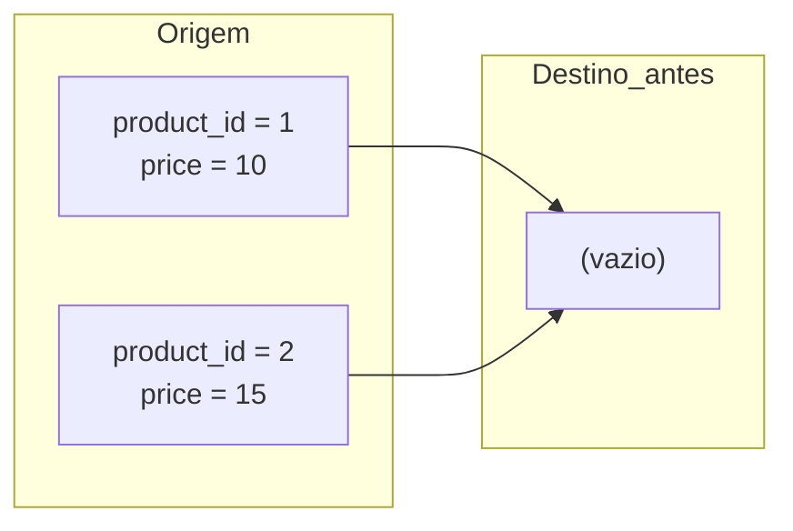
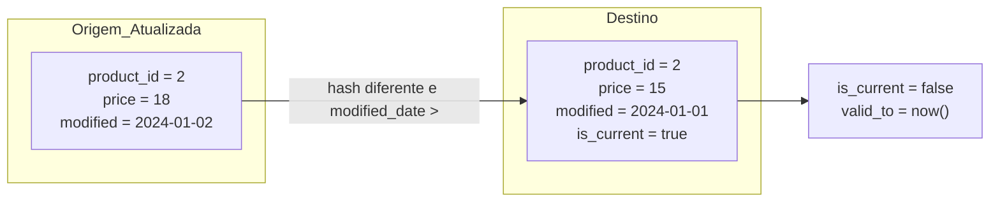
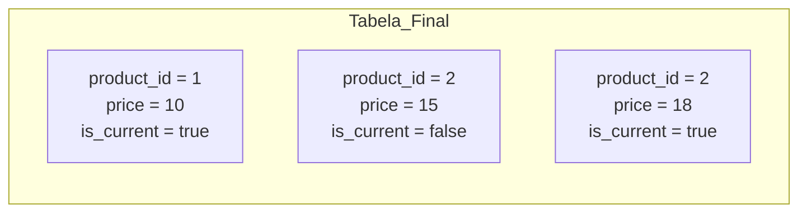

## 📘 Exemplo 5 – SCD Type 2 com Hash, `modified_date` e Três Etapas

Neste exemplo, vamos implementar um controle de histórico do tipo **SCD Type 2 (Slowly Changing Dimension)**. Esse padrão é usado quando precisamos manter todas as versões anteriores de um registro — preservando o histórico de mudanças.

### 🧠 O que é SCD Type 2? 

O SCD Type 2 cria **um novo registro** a cada alteração detectada, mantendo a versão anterior com um campo de controle (`valid_to`, `is_current`, etc.). Isso é essencial para:

- Auditar mudanças
- Gerar relatórios que respeitam o valor vigente em determinado período
- Reconstruir o estado histórico de uma dimensão

### 🔍 Como detectamos mudanças?

Usamos o `hash` calculado sobre as colunas de negócio (excluindo colunas técnicas) para identificar se algo mudou. Além disso, usamos `modified_date` para garantir que só atualizamos com dados mais recentes.

---

### 🧮 Como o Hash é calculado (em PySpark)?

```python
from pyspark.sql.functions import xxhash64, current_date, lit, coalesce, col, concat_ws, date_add, current_timestamp

# Carregar dados
df_source = spark.table("source_bronze.sales_salesorderdetail_insert_duplicates")

# Simular modificação futura (apenas para exemplo)
df_source = df_source.withColumn("ModifiedDate", date_add(df_source["ModifiedDate"], 50))

# Construir hash baseado em todas as colunas
stringified_columns = [coalesce(col(c).cast("string"), lit("NULL")) for c in df_source.columns]
df_source = df_source.withColumn("hash_value", xxhash64(concat_ws("||", *stringified_columns)))

# Adicionar colunas de controle SCD2
df_source = df_source.withColumn("is_current", lit(True)) \
                     .withColumn("start_date", current_timestamp()) \
                     .withColumn("end_date", lit(None).cast("date"))

# Criar view temporária para ser usada no SQL
df_source.dropDuplicates(["SalesOrderDetailID"]).createOrReplaceTempView("df_source")
```

---

### 🔁 A estratégia SCD2 ocorre em 3 etapas:

#### 🔹 Etapa 1 – Inserir Novos Registros



#### 🔹 Etapa 2 – Finalizar Registros com Hash diferente e `modified_date` mais recente



#### 🔹 Etapa 3 – Inserir Nova Versão (apenas se modified_date for maior)



---

### 🧾 Exemplo de Dados – Antes e Depois

#### 🔍 Origem (dados da fonte)

| product_id | price | modified_date     | Observação                                     |
|------------|-------|-------------------|------------------------------------------------|
| 1          | 10    | 2024-01-01        | Novo                                           |
| 2          | 15    | 2024-01-01        | Novo                                           |
| 2          | 18    | 2024-01-02        | Atualização válida                             |
| 2          | 18    | 2024-01-01        | ⛔️ Ignorado – mesma versão com data antiga     |
| 2          | 15    | 2023-12-30        | ⛔️ Ignorado – versão antiga, sem impacto       |

#### ✅ Tabela Final (com histórico)

| product_id | price | modified_date     | valid_from       | valid_to         | is_current | hash_value |
|------------|-------|-------------------|------------------|------------------|------------|------------|
| 1          | 10    | 2024-01-01        | 2024-01-01       | *(null)*         | ✅ true     | A1X...     |
| 2          | 15    | 2024-01-01        | 2024-01-01       | 2024-01-02       | ❌ false    | B7F...     |
| 2          | 18    | 2024-01-02        | 2024-01-02       | *(null)*         | ✅ true     | 9ZK...     |

---

### 💻 Código SQL dividido em 3 partes

#### ☑️ Etapa 1 – Inserção inicial

```sql
MERGE INTO hive_metastore.target_silver.ex5_sales_salesorderdetail AS target
USING df_source AS source
ON target.SalesOrderID = source.SalesOrderID AND target.SalesOrderDetailID = source.SalesOrderDetailID
WHEN NOT MATCHED THEN
  INSERT *
```

#### 🛑 Etapa 2 – Finalizar versões antigas

```sql
MERGE INTO hive_metastore.target_silver.ex5_sales_salesorderdetail AS target
USING df_source AS source
ON target.SalesOrderID = source.SalesOrderID AND target.SalesOrderDetailID = source.SalesOrderDetailID
WHEN MATCHED AND target.hash_value != source.hash_value AND target.is_current = TRUE AND source.ModifiedDate > target.ModifiedDate THEN
  UPDATE SET target.is_current = FALSE,
             target.end_date = CURRENT_DATE
```

#### 🔁 Etapa 3 – Inserir nova versão (usando CTE com filtro)

```sql
WITH filtered_source AS (
  SELECT source.*
  FROM df_source AS source
  LEFT JOIN hive_metastore.target_silver.ex5_sales_salesorderdetail AS target
  ON target.SalesOrderID = source.SalesOrderID AND target.SalesOrderDetailID = source.SalesOrderDetailID
  WHERE source.ModifiedDate > target.ModifiedDate
)
MERGE INTO hive_metastore.target_silver.ex5_sales_salesorderdetail AS target
USING filtered_source AS source
ON target.SalesOrderID = source.SalesOrderID AND target.SalesOrderDetailID = source.SalesOrderDetailID AND target.hash_value = source.hash_value 
WHEN NOT MATCHED THEN
  INSERT *
```

---

### 💻 Código PySpark equivalente (versão alternativa)

```python
from delta.tables import DeltaTable

# Etapa 1 - Atualizar registros encerrando versões antigas
DeltaTable.forName(spark, "target_silver.ex5_sales_salesorderdetail")\
  .alias("target")\
  .merge(
    df_source.alias("source"),
    "target.SalesOrderID = source.SalesOrderID AND "
    "target.SalesOrderDetailID = source.SalesOrderDetailID AND "
    "target.is_current = true AND source.hash_value != target.hash_value AND "
    "source.ModifiedDate > target.ModifiedDate"
  )\
  .whenMatchedUpdate(set={
    "is_current": "false",
    "end_date": "current_date()"
  })\
  .execute()

# Etapa 2 - Inserir novas versões filtrando source por modified_date > target
mais_novos = df_source.alias("source").join(
  spark.table("target_silver.ex5_sales_salesorderdetail").alias("target"),
  on=["SalesOrderID", "SalesOrderDetailID"],
  how="left"
).filter("source.ModifiedDate > target.ModifiedDate OR target.SalesOrderID IS NULL")

DeltaTable.forName(spark, "target_silver.ex5_sales_salesorderdetail")\
  .alias("target")\
  .merge(
    mais_novos.alias("source"),
    "target.SalesOrderID = source.SalesOrderID AND "
    "target.SalesOrderDetailID = source.SalesOrderDetailID AND "
    "target.hash_value = source.hash_value"
  )\
  .whenNotMatchedInsertAll()\
  .execute()
```

---

### ✅ Conclusão

Este exemplo demonstrou com clareza como implementar o padrão **SCD Type 2 com hash e `modified_date`** em um ambiente Lakehouse com Delta Lake. Dividimos o processo em etapas lógicas:

1. Inserção de novos registros
2. Finalização dos registros existentes com mudanças
3. Inserção de novas versões com base na data mais recente

Incluímos código completo em SQL e PySpark, tabelas com antes e depois e diagramas para facilitar o entendimento.

Na próxima etapa, evoluiremos para o **Exemplo 6**, no qual lidaremos com **cargas históricas**, utilizando a função `for loop` para garantir criar uma versão histórica sem pular mudanças intermediárias

Vamos lá!

