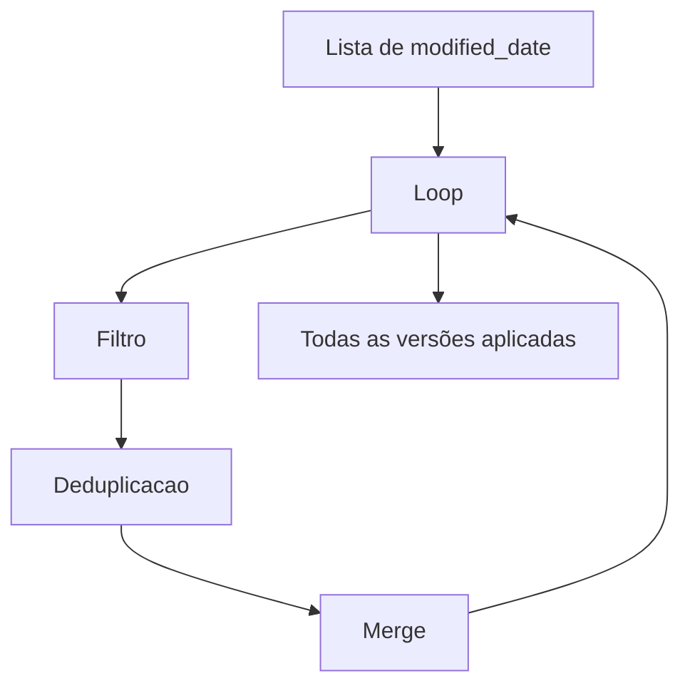

## 📘 Exemplo 6 – Recarga Histórica com Iteração por `modified_date`

Neste exemplo, vamos lidar com **múltiplas versões de um mesmo registro** que chegam em diferentes datas. A ideia é garantir que **todas as alterações sejam aplicadas em ordem cronológica**, preservando o histórico completo usando o padrão **SCD Type 2**.

---

### 🧠 Cenário

Em pipelines de produção, normalmente lidamos com apenas a versão mais recente de um dado. No entanto, em situações de:

- 🔁 Recarga completa
- 🧼 Manutenção de histórico
- 🔄 Reprocessamento retroativo

...é essencial garantir que todas as **versões intermediárias** sejam aplicadas corretamente.

---

### 🎯 Estratégia Utilizada

1. Obter os valores distintos de `modified_date` da fonte.
2. Iterar sobre cada data, **em ordem cronológica**.
3. Para cada `modified_date`:
   - Filtrar os dados daquele dia.
   - Remover duplicatas com `row_number()` para manter o registro mais recente por ID.
   - Aplicar o padrão SCD2 com `MERGE`.

Essa abordagem permite aplicar alterações **na ordem em que aconteceram**, garantindo a integridade do histórico.

---

### 🔁 Diagrama da Estratégia com Loop



---

### 🔢 Exemplo de Dados com Múltiplas Versões

#### 🔍 Origem (dados da fonte)

| product_id | price | modified_date     | Observação                          |
|------------|-------|-------------------|-------------------------------------|
| 1          | 10    | 2024-01-01        | Novo                                |
| 2          | 15    | 2024-01-01        | Versão 1                            |
| 2          | 15    | 2024-01-01        | ⛔️ Duplicado (ignorar)              |
| 2          | 16    | 2024-01-02        | Versão 2                            |
| 2          | 18    | 2024-01-03        | Versão 3 (final)                    |

#### ✅ Tabela Final Esperada (com histórico completo)

| product_id | price | modified_date     | valid_from       | valid_to         | is_current |
|------------|-------|-------------------|------------------|------------------|------------|
| 1          | 10    | 2024-01-01        | 2024-01-01       | *(null)*         | ✅ true     |
| 2          | 15    | 2024-01-01        | 2024-01-01       | 2024-01-02       | ❌ false    |
| 2          | 16    | 2024-01-02        | 2024-01-02       | 2024-01-03       | ❌ false    |
| 2          | 18    | 2024-01-03        | 2024-01-03       | *(null)*         | ✅ true     |

---

### 🧪 Código PySpark – Loop por `modified_date` com deduplicação

```python
from delta.tables import DeltaTable
from pyspark.sql.window import Window
from pyspark.sql.functions import row_number, col

# Obter lista de datas distintas ordenadas
datas = [row.modified_date for row in df_source.select("modified_date").distinct().orderBy("modified_date").collect()]

target_table = DeltaTable.forName(spark, "target_silver.ex6_sales_orderdetail")

for data in datas:
    print(f"\n🔁 Processando dados de: {data}")

    dia_df = df_source.filter(col("modified_date") == data)

    # Deduplicação com row_number por chave natural
    window_spec = Window.partitionBy("SalesOrderID", "SalesOrderDetailID").orderBy(col("modified_date").desc())
    dia_df = dia_df.withColumn("row_num", row_number().over(window_spec)).filter("row_num = 1").drop("row_num")
    dia_df.createOrReplaceTempView("source_dia")

    # 1. Finalizar registros antigos
    spark.sql("""
    MERGE INTO target_silver.ex6_sales_orderdetail AS target
    USING source_dia AS source
    ON target.SalesOrderID = source.SalesOrderID AND target.SalesOrderDetailID = source.SalesOrderDetailID
    WHEN MATCHED AND target.hash_value != source.hash_value AND target.is_current = TRUE AND source.modified_date > target.modified_date THEN
      UPDATE SET target.is_current = FALSE,
                 target.end_date = CURRENT_DATE
    """)

    # 2. Inserir nova versão
    spark.sql("""
    WITH filtered_source AS (
        SELECT source.*
        FROM source_dia AS source
        LEFT JOIN target_silver.ex6_sales_orderdetail AS target
        ON target.SalesOrderID = source.SalesOrderID AND target.SalesOrderDetailID = source.SalesOrderDetailID
        WHERE source.modified_date > target.modified_date OR target.SalesOrderID IS NULL
    )
    MERGE INTO target_silver.ex6_sales_orderdetail AS target
    USING filtered_source AS source
    ON target.SalesOrderID = source.SalesOrderID AND target.SalesOrderDetailID = source.SalesOrderDetailID AND target.hash_value = source.hash_value
    WHEN NOT MATCHED THEN
      INSERT *
    """)
```

---

### ✅ Conclusão

Neste exemplo, demonstramos como realizar uma **recarga completa e cronológica de um histórico SCD2** usando o campo `modified_date` como guia.

Também garantimos que, dentro de cada data, apenas o **registro mais recente por ID** seja utilizado, evitando duplicações e conflitos de `MERGE`.

Essa abordagem é ideal para:

- 🧹 Pipelines de manutenção
- 🔁 Reprocessamento histórico
- 📦 Aplicação de múltiplas versões intermediárias

Na prática, garantimos que cada versão de um mesmo registro seja inserida e encerrada corretamente, mantendo a integridade e rastreabilidade dos dados.

Pronto para avançar para o próximo desafio? 🚀

