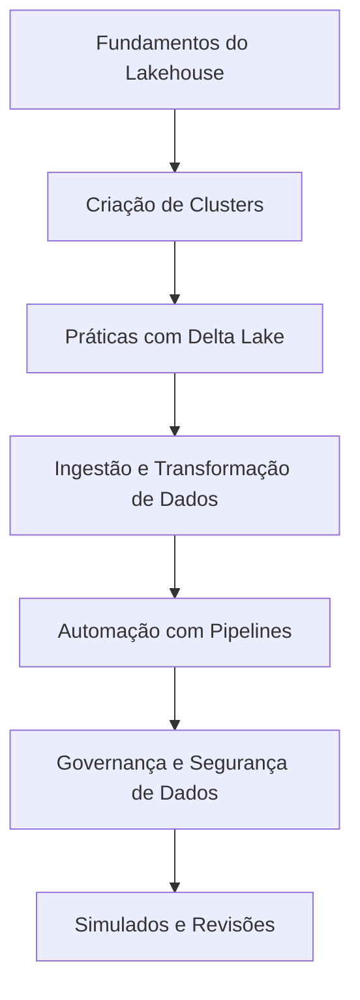

# Roadmap Certificação Databricks Data Engineer Associate

---

## Objetivo do Guia

Este guia tem como finalidade oferecer um material completo de estudo para a certificação **Databricks Data Engineer Associate**, com base no **Treinamento Aprender Dados**, que é a base teórica desta preparação. 

O treinamento ensina de forma prática e teórica os principais tópicos cobrados no exame, complementado por simulados exclusivos e materiais de apoio.

---

## Como é a prova da certificação?

O exame está dividido em tópicos de alta relevância para um engenheiro de dados iniciante, com base em cenários práticos e arquiteturas modernas como Lakehouse. 

Os principais temas incluem:

(todos esses assuntos estão detalhados no treinamento completo)

1. **Databricks Lakehouse Platform (24%)**
   - Compreender as vantagens e uso da plataforma Lakehouse.
   - Gerenciamento de tabelas Delta e otimizações Delta.

2. **ETL com Spark SQL e Python (29%)**
   - Transformações de dados.
   - Configuração de tabelas e ingestão de dados.

3. **Processamento Incremental de Dados (22%)**
   - Gerenciamento de pipelines de dados em tempo real.
   - Controle incremental de atualizações.

4. **Pipelines de Produção (16%)**
   - Criação e gerenciamento de pipelines resilientes.
   - Melhores práticas de automação de tarefas repetitivas.

5. **Governança de Dados (9%)**
   - Práticas de segurança e controle de acessos.
   - Organização e estrutura de catálogos de dados.

---

## Conheça a preparação para certificação Databricks DataEng Associate

[**Adquira agora o Treinamento**](https://pay.kiwify.com.br/hP20Upy)

[**Já comprei o curso**](https://alunos.aprenderdados.com/189295-preparatorio-databricks-data-engineering-associate)

Nosso treinamento abrange as principais áreas para a certificação, organizadas em módulos:

1. **Introdução ao Databricks Community + Workspace + PySpark + SQL**
2. **Clusters e Otimização**
3. **Ingestão de Dados com PySpark e SQL**
4. **Delta Lake e Arquitetura Lakehouse (Bronze, Prata e Ouro)**
5. **Ingestão Incremental com AutoLoader**
6. **Automação de Pipelines com Workflows**
7. **Delta Live Tables e Unity Catalog**
8. **Preparação para Certificação**

---

## Simulados Exclusivos da Aprender Dados

Nossos simulados são parte fundamental da preparação:

**Simulado 1: Preparação Inicial**  
**Simulado 2: Intermediário**  
**Simulado 3: Avançado**  
   - [Adquira Aqui](https://pay.kiwify.com.br/hP20Upy)

---

## Recursos Complementares

1. **Playlist "Introdução ao Databricks" - Aprender Dados**  
   - Conheça os fundamentos do Databricks:  
   - [Acesse a Playlist](https://www.youtube.com/playlist?list=PLnxUgOpvXnWzTkha0174lXfES019PQz9U)

2. **Lakehouse Fundamentals - Live Exclusiva**  
   - Fundamentos do Lakehouse com exemplos práticos:  
   - [Assista à Live](https://www.youtube.com/watch?v=jshH5WVN5uw)

---

## Dicas Avançadas para Passar no Exame

1. **Aprofunde-se nos conceitos do Delta Lake:**
   - Compreenda a arquitetura Bronze, Silver e Gold.
   - Realize práticas com Delta Live Tables.

2. **Pratique Otimizações:**
   - Experimente o **Z-ordering**, **Data Skipping** e particionamento de tabelas para consultas rápidas.

3. **Estratégias no dia do exame:**
   - Leia as questões com calma; muitas respostas dependem de detalhes específicos.
   - Foque em eliminar respostas incorretas antes de escolher a correta.

---

## Diagrama: Fluxo de Estudo e Implementação

Segue o diagrama atualizado com os principais fluxos de estudo e implementação:

---

## Seu Checklist para aprovação

1. [ ] Complete o **Treinamento Aprender Dados**.
2. [ ] Realize os três simulados.
3. [ ] Participe da live "Lakehouse Fundamentals".
4. [ ] Pratique com exemplos delta tables e Spark SQL.
5. [ ] Revise os tópicos principais regularmente.

---

Este guia reflete o método estruturado da **Aprender Dados** para ajudar na sua aprovação na certificação. 

